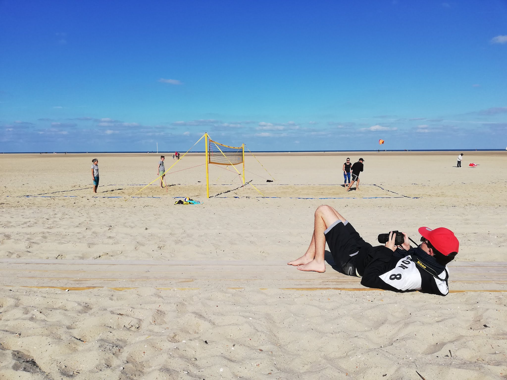

### Finn Schremmer Portfolio

# I'm Finn Schremmer and i'm a student on ZUYD in Maastricht

My projects i made are:

* A website for my own created and designed web-magazine 
http://student-1850512schr.mamdt.com/11-whole-task/

* The design for a mobile healthy lifestyle app 
http://student-1850512schr.mamdt.com/12-whole-task/pitch.pdf

* A random techno-music genarator that makes generative music and a unique "De Stijl" painting 

